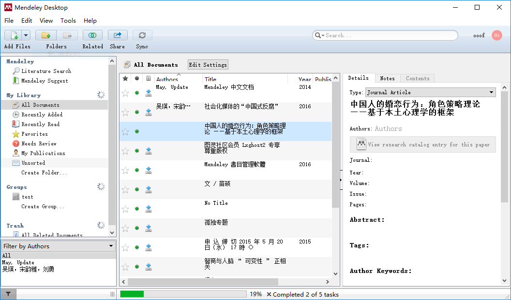
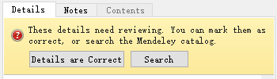
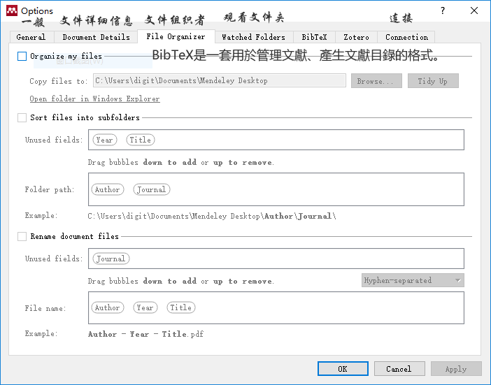

#Mendeley 基础了解

Mendeley 是一个文档管理系统，我主要用它管理 PDF 文件。

## 0. Mendeley 简史

Mendeley 一开始是由三个德国苦逼 PhD 捣鼓出来的，名字源于遗传学家孟德尔（Gregor Mendel）和化学家门捷列夫（Dmitri Mendeleyev）。Mendeley甫一出世就凭借其超前的理念和强大的产品功能获得多个欧洲大奖。

2013 年Mendeley 被出版大鳄 Elsevier 收购，Elsevier 曾遭学术界的抵制，[ 详情看这里 ](https://github.com/ooof/Project-2017/blob/master/1.%E9%A1%B9%E7%9B%AE/%E8%87%AA%E7%94%B1%E4%B9%A6%E5%86%99/Mendeley%20%E9%9B%B6%E6%98%9F%E7%9F%A5%E8%AF%86/Mendeley%20%E6%AF%8D%E5%85%AC%E5%8F%B8%E7%AE%80%E5%8F%B2.md)。

## 1. Mendeley 功能介绍

通过 Mendeley ，可以把你指定目录下的文档（PDF）自动吸纳到 Mendeley ，并进行统一管理，包括：

- 可以方便的了解你所收集的所有文档；可以**直接打开**查看；可以对文档分类或加星；可以对文档本身做批注，也可以对文档中的内容做批注或划分重点句子。
- 方便的**主题词搜索**
- 当把PDF文件导入到你的Library的时候，无论多么杀马特的文件名都能准确地自动转换为**文章标题**，同时**抓取的内容**还包括作者、期刊名、杂志期卷号、页码、文章摘要和DOI、ISSN、PMID等重要信息。对有些比较难搞的古董级PDF文献，即使Mendeley不能准确读取相关信息也大可不必担心，直接点击文章的DOI、ISSN或PMID号，即可通过网络自动获取相关信息。
- 有些人习惯将不同主题或类型文献存在电脑的不同文件夹中，这给文献管理带来了麻烦。Mendeley可以**同时“监视”**（Watch）你电脑里多个文件夹，只要刷新一下你的Library，任何新增的PDF文献都会被自动添加进来。
- 有时候我们浏览网页看到一些暂时不需要或无法获取全文的文献，想快速保存其相关信息怎么办？Mendeley的一键抓取功能可以完美解决这种需求。在你的浏览器下载并安装**Citation plugin插件**，只要打开网页，点击浏览器上的Save to Mendeley就可以轻松搞定一切，画面很美有没有？
- Mendeley还同时具有**标注（Annotation）**功能，不需借助任何第三方软件即可随意对PDF进行加亮和标注。这些注释会自动保存在你的文献数据库中。
- 用户可以通过就不同主题对**文献进行分组（Groups）**实现文献管理。这些Groups一方面是文献分类的载体（类似于文件夹），同时还具有社交网络的属性。
	- 私人组群（Private Groups）适用于小的团队，小组成员可以访问、修改组内所有的文献资料、共享PDF全文等。私人小组不会显示在Mendeley的网页信息中，用户需要被邀请才能加入。
	- 限邀组群（Invite-only groups）虽然会显示在Mendeley的网页上，同样只有受到邀请的成员才能加入；对于非小组成员的用户，则可以Follow小组的相关信息，可以追踪组内的各种讨论并获取小组内的共享材料。
	- 开放组群（Open groups），对所有用户完全开放，任何人都可以在组内添加新文献，因此有着共同兴趣的组成员可以通过它进行问题探讨，快速获取、分享相关领域的重要文献。同时，Mendeley还具有Researchgate的类似属性：在个人资料里上传自己发表的文章，就可以看到有多少人在读你的研究结果，这些人的研究领域是什么，分别来自哪些国家等等。最近正在测试的Stats功能则可以按时间显示你发表的被Scopus数据库收录的文章在ScienceDirect网站的被浏览次数，在Scopus数据库的被引用次数等更为全面的信息。

- 在Endnote上的文献可以直接无缝移植到Mendeley。

Mendeley 分为 **网页版** 与（在本地执行的） **程序版** ，两者提供基本相似的文档管理功能，且所做处理能够自动同步；本地版文档管理功能更强，网页版支持更多与他人及他人文档的交互功能。

## 2. Mendeley 部分界面译文

### 2.1 下图是 Mendeley 主界面的外观，

 

### 2.2 下图是新文件进入，要求搜索补全文档属性的提示

 

> 这些细节需要审查。 您可以将它们标记为正确，或搜索门德利目录。
> 
> 详情正确  搜索

### 2.3 下图是 Mendeley 配置界面的外观，位置在主菜单 Tools - Options ，可以设置一些使用方法及习惯。

 

### 2.4 下面是左侧工具栏的翻译

> Mendeley
> Literature Search  文献搜索
> Mendeley Suggest  建议
> 
> ===
> 
> My Library   我的图书馆
> 
> All Documents   所有文件
> Recently Added  最近添加
> Recently Read   最近阅读
> Ravorites
> Needs Review  需要审查
> My Pubications  我的出版物

### 2.5 

> There was a problem connecting to mendeley.com to sync your library:Network access is disabled.
> 
> Connectiong settings
> 
> 连接到mendeley.com以同步您的书架时出现问题：网络访问已停用。
> 
> Connectiong设置

### 2.6

> Mendeley was able to connect using these settings.
> 
> Mendeley能够使用这些设置进行连接。

### 2.7 

> Related 有关

### 2.8 

> Unable to open PDF - 
