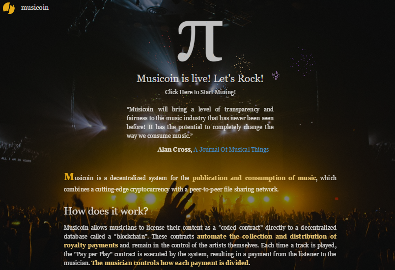
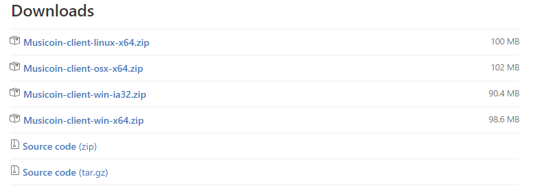
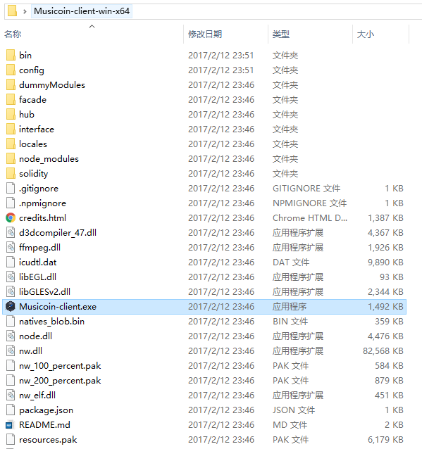
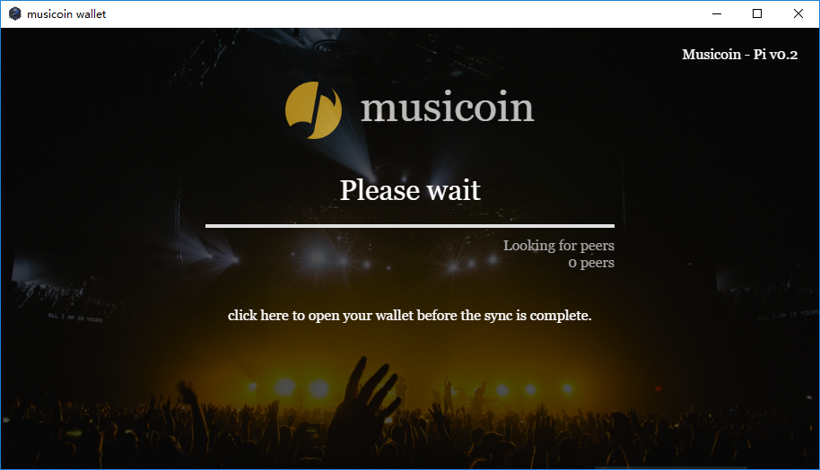
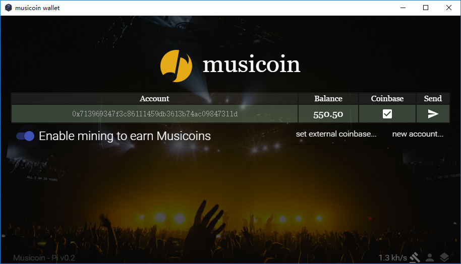
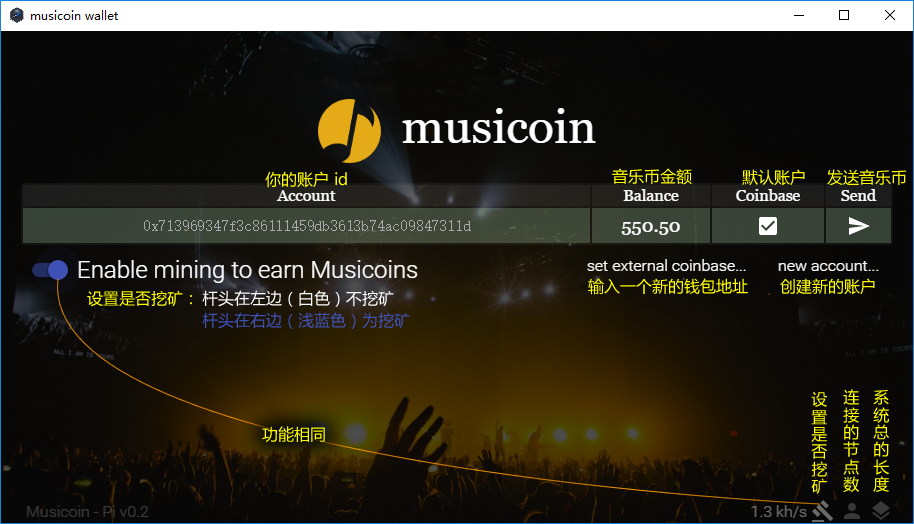

# Musicoin（樂幣），一种全新的音乐发行与消费模式

<<<<<<< HEAD
> 采用第三代加密数字货币，比第一代智能，比第二代实用，且专门用于人人都需要的音乐消费。

2017年1月10日，一种全新的音乐发行与消费模式诞生，新模式避免了传统音乐发行的弊端，旨在促进健康的音乐创作与消费环境。与新模式相匹配，还诞生了一种全新的数字货币 —— Musicoin，中文名称为：乐币 与 樂幣，Musicoin （乐币）将为全新的音乐发行与消费模式提供价值交换支持。

**新音乐发行与消费模式采用目前三种最新技术：**

1. [PPP](https://en.wikipedia.org/wiki/Pay_per_play)（Pay per Play，每次播放付费）许可模式。
2. [IPFS](https://ipfs.io/)（The InterPlanetary File System）点到点的分布式文件分发技术。
3. [blockchain](https://zh.wikipedia.org/wiki/%E5%8C%BA%E5%9D%97%E9%93%BE) （区块链）技术提供支付。以 Ethereum 为基础开发，但借鑑了Bitcoin 的一些教訓，包括交易成本和經濟模式的重新考慮。

**特性**

1. Musicoin 没有总的货币数量，持续供应，采集难度不断增加；单位 block 产生的数量不变，永远是 314 个。
2. 系统本身不会赚钱，100%歸音樂家所有，全部透明可监督。
3. 全球流通。

想及时了解 Musicoin 最新信息，可以访问以下 Musicoin 官方媒体：

1. 网站：[https://musicoin.org/](https://musicoin.org/) 
1. 论坛：[http://forum.musicoin.org/](http://forum.musicoin.org/)
1. 推特：[https://twitter.com/musicoins](https://twitter.com/musicoins)
1. 文档：[https://medium.com/@musicoin](https://medium.com/@musicoin)
1. GitHub：[https://github.com/Musicoin/](https://github.com/Musicoin/) 

 

##  1. Musicoin 的安装与使用

### 1.1 Musicoin 客户端的安装

Musicoin 客户端是用户与系统连接的界面，通过 Musicoin 客户端可以收听音乐（未来发布），挖矿赚取音乐币，以及基本的音乐币管理。

安装 Musicoin 客户端需要去官方 GitHub 下载安装包，地址为：[https://github.com/Musicoin/desktop/releases](https://github.com/Musicoin/desktop/releases)，下载文件见下图。

由文件名可知，提供了 Linux 、OSX 、Windows 三种系统的版本，还有开源代码。其中 Windows 分为 32 位与 64 位的版本（选用什么版本与用户的操作系统版本有关，64 位的操作系统两种版本都可以使用，32 位的操作系统只能使用 32 位的软件）。

特别方便的是，在 Windows 系统中，软件下载回来，解压缩到任何一个地方，不需要安装就可以使用。

点击文件夹中的唯一可执行文件 Musicoin-client.exe 就会启动系统。

### 1.2 Musicoin 的使用界面

目前只显示两个界面，一个是启动界面，一个是钱包的界面。启动界面如下图所示。

在启动界面几乎不需要做什么操作，如果软件与其它节点建立稳定连接，就会自动转到音乐币操作界面，如下图所示。

钱包界面各项功能如下图所示。

其中系统总长度数字是区块链的区块总数，区块总数 x 500 就是总的货币发行量。 

 

## 2. 相关信息及链接

### 2.1 Slack 频道

Musicoin 设立了用于及时交流及技术支持 Slack 账户 [http://slack.musicoin.org](http://slack.musicoin.org)，以下几个频道值得关注。

- #chinese，针对中文用户设立的频道
- #trading，一個私人交易所
- #miner，交流如何挖矿

### 2.2 使用

- [http://orbiter.musicoin.org/](http://orbiter.musicoin.org/)，查看矿区情况；在链接后面加你的编码可以查看你的账目，比如：[http://orbiter.musicoin.org/addr/0x147605725efea6ed53e1630c718568db5e248b55](http://orbiter.musicoin.org/addr/0x147605725efea6ed53e1630c718568db5e248b55)。

### 2.3 技术

- Musicoin 客户端程序启动后，在程序目錄下面找到 bin/go-musicoin/gmc.exe 可以查看软件运行的状态。
- Musicoin 客户端程序使用系统的 30301、30303 端口，如果程序无法与其它节点建立连接，可以检测是否本地防火墙关闭了这两个端口。
- 另外有三个 IP 与程序的运行有关，有问题时可以 Ping 这三个 IP 的连接是否正常：
    - 35.185.39.34 
    - 104.199.167.97
    - 104.155.43.197

### 2.4 开发

- [https://musicoin.org/api](https://musicoin.org/api)  這是API 文檔，如果開發人員有什麼問題，可以到slack 提供。

### 2.5 挖矿

- 挖矿程序：https://github.com/Musicoin/go-musicoin/releases
- [https://bitcointalk.org/index.php?topic=1776113](https://bitcointalk.org/index.php?topic=1776113)，关于挖矿的讨论。

**最后，期待音乐家们了解入驻，期待音乐爱好者开始挖矿赚钱，也期待各种有拓展性的开发者参与新音乐环境的扩展。**

----------

## Musicoin 相关文本

1. Musicoin（樂幣），一种全新的音乐发行与消费模式：[https://github.com/ooof/Project-2017/blob/master/Musicoin/Hb_Musicoin.md](https://github.com/ooof/Project-2017/blob/master/Musicoin/Hb_Musicoin.md)

- 音乐家为什么应该（以及如何）使用 Musicoin？：[https://github.com/ooof/Project-2017/blob/master/Musicoin/hb-musicoin-faq.md](https://github.com/ooof/Project-2017/blob/master/Musicoin/hb-musicoin-faq.md)
- Musicoin （乐币）系统的通俗介绍：[https://github.com/ooof/Project-2017/blob/master/Musicoin/hb-tongsu.md](https://github.com/ooof/Project-2017/blob/master/Musicoin/hb-tongsu.md)
