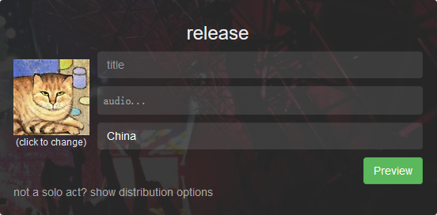
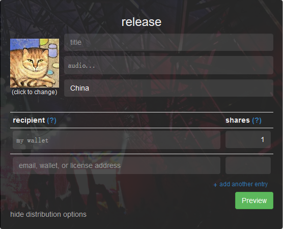
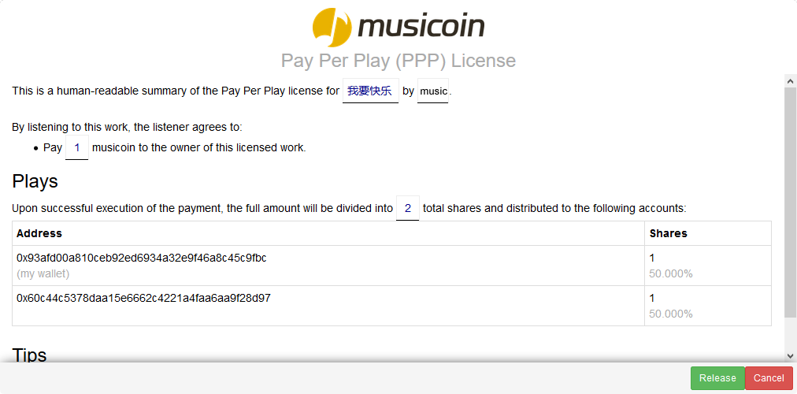
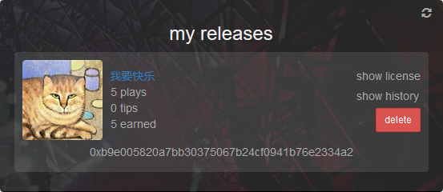

# 音乐家为什么应该（以及如何）使用 Musicoin ？ 

Musicoin 音乐已经上线，目前通过网页方式（[https://alpha.musicoin.org/](https://alpha.musicoin.org/)）收听，
下面通过问答，介绍收听与发布相关的几个问题。

## 1. 如果 Musicoin 不是基于传统货币，听众如何获得硬币？

Musicoin 系统中的所有硬币都来自采矿。然而，我们知道大多数听众可能没有时间或兴趣去采矿，在早期，我们配置服务器挖矿，替用户支付收听费用，而音乐家则可以得到全额的收入。另外，听众也可以通过 http://slack.musicoin.org 的 #trading 频道交换硬币。

## 2. 听众为什么愿意为音乐付费？

我们相信，大多数听众会乐意给他们喜欢的音乐家支付费用，盗版由两个因素驱动：

> 1. 方便
> 2. 听众和艺术家之间缺乏连接

通过建立一个简单，低成本的系统，提供听众和艺术家之间的直接联系，我们认为没有人有非法获得音乐的动机。

## 3. 谁设置每首音乐的价格 - 音乐家或听众？

我们的目标是让音乐家自己控制一切。他们可以使用标准价格（也就是每收听一次一个硬币），或者他们也可以根据个人意愿设置更高或更低的价格。此外，音乐家可以自定义如何分配每笔付款。

## 4. 发布音乐需要注意什么？

如果一首作品的音乐家只有一个人，那么填写以下内容就可以发布：

> 1. 音乐名称
> - 上传音乐文件
> - 并填写一些关键词
> - 可以给音乐更换一个贴切的封面

如下图所示。

如果一首作品的音乐家有多个人，那么可以点击下面的 “not a solo act? show distribution options”点开分成选项。

在分成选项中，默认只有一个分成人（也就是您），点击 “+ add another entry ”会增加一行填写框，在这里可以添加更多的合作者，如下图所示。

> 1. 在前面的框，填写合作者的钱包地址。为方便记忆也可以输入合作者注册 Musicoin 的邮件地址。如果有词曲授权方，还可以输入词曲授权方的地址。
> 
> 2. 在后面的框，填写分成方式。分成用整数表示，如果有三个乐队成员，其他们等到相同的金额，那么可以可以设置为，每个人为 1 。如果分成总数为 100 的话，就与百分百的的情况相同。

填写完成后，点击“Preview”就可以查看授权协议，如下图所示。

然后点击下面绿色的 “Release”按钮就可以发布。

## 5. 用户付费后，音乐家多长时间可以收到硬币？

几乎立刻。

当发布的音乐有用户收听后，在音乐家 https://alpha.musicoin.org/nav/profile 页面的 My Releases 位置可以查看播放数量，点击 “show history”可以查看收入情况，如下图所示。

## 6. 那么，我现在如何获得邀请？

我们想确保每个音乐家和听众都有一个良好的使用 Musicoin 的体验，所以我们慢慢增加用户数量。如果您是音乐家或只是对测试有兴趣，请发送电子邮件至 musicoin@musicoin.org。

参考来源：[https://alpha.musicoin.org/faq#WhatIsARecipient](https://alpha.musicoin.org/faq#WhatIsARecipient)