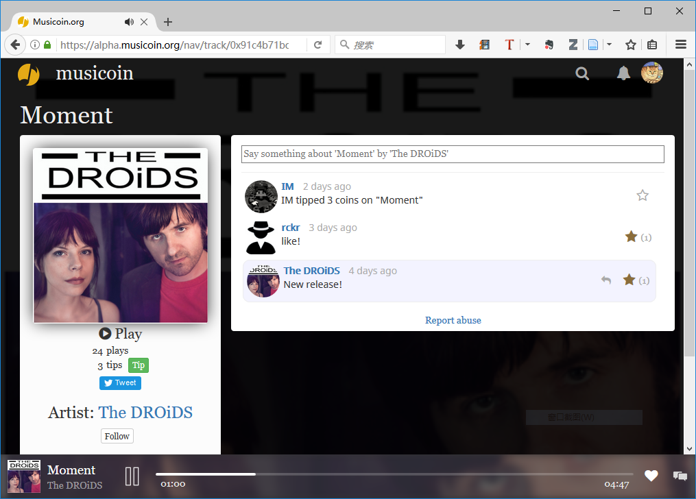

# Musicoin （乐币）系统的通俗介绍 

这是一个音乐发布与收听的系统。

> 也就是音乐家用它发布音乐，大众用它收听音乐。

为了对艺术作品及创作提供支持，在收听音乐的时候，大众需要向艺术家支付一定的费用（系统自动执行，费用由音乐家制定）。

> 费用由一种称作 Musicoin （中文名为“乐币”）的数字货币承载。Musicoin 是一种比特币的衍生数字货币，将来可以在数字货币市场流通。

## 1. 创建 Musicoin 的出发点？

大众需要音乐，创作需要成本，大众在获得音乐享受的同时，最好用某种恰当的方式去回报音乐创作者。而传统的音乐发行模式不能很好的保证音乐家的收入，Musicoin 为解决这个难题而创建。

> 相似国内产品有汪峰创建的“碎乐”：[www.suiyueyule.com](www.suiyueyule.com) ，但差异也很多。

## 2. 收听费用是怎么样制定的？

一首音乐，用户每收听一次，就向音乐家支付一次费用，具体费用由音乐家制定（目前默认是一个乐币）。

收听所得费用 100% 归音乐家支配。系统不会分成，也不会赚取任何其它费用。

## 3. 最初的货币（乐币）是怎么来的？

与比特币一样，最初（以及所有）的货币都由矿工挖矿所得。

听众可以自己挖矿，或在交易市场购买乐币，最初，系统会帮用户支付一定的收听费用。

## 4. Musicoin（乐币）除了收听音乐还有什么价值？

Musicoin 会与其它数字货币对接，有些国际交易所已经在准备上线，中国地区还没有交易所开始交易。

> 国内类似的数字货币交易所：[https://bter.com/](https://bter.com/)

## 5. 如何实际体验？

- Musicion 官网：[https://musicoin.org/](https://musicoin.org/)

- 音乐播放示例：[https://alpha.musicoin.org/nav/track/0x91c4b71bd729f0162e5144f64fe76a7e3f190d5d](https://alpha.musicoin.org/nav/track/0x91c4b71bd729f0162e5144f64fe76a7e3f190d5d) ，此链接的界面如下图所示（点击播放按钮就可以播放，在移动设备也可以）：

## 6. 如何登录？

目前两种方式进入：

1. 好友邀请；
2. 在这里申请进入：[https://musicoin.org/invite?type=musician](https://musicoin.org/invite?type=musician)

但目前两种方式收到注册链接后，都需要通过国外社交网站，如 Google 、Twitter 、Facebook 的账户登录，这样需要用户有科学上网能力。如果暂时不具备需要等网站支持新浪微博登录以后再进入。

## 7. 音乐家如何上传作品？

以录音文件方式，比如 MP3 格式的文件上传就可以。

## 8. 部分用户的评论、疑惑或建议

- 这个很好，乐评人也会加入（乐评如果被点赞，乐评人会有一个乐币的收入）。
- 我觉得如果是纯粹的听歌收费应该很难推广吧。现在的音乐平台那么多，大多数音乐都能免费获得，既然要收费，音乐的质量上就行就得独特才行。
- 适合和音乐公司合作，推新人。
- 小众的平台只能是从一些独立音乐上入手，我的意思是，要从音乐的选择上入手，从一些小众的，音乐性强的，非大众音乐平台上能听到的音乐入手，去进行收费，才有可能慢慢有一个良好的循环吧。
- 音乐家自己去放一些自己的原创demo啊之类的我觉得也挺好的。不一定是完整的，但是在音乐人之间可能会有一个良好的交流。
- 我觉得这样的话，对音乐的挑选就很重要了。要有品质和独特性的保证。

## Musicoin 相关文本

1. Musicoin（樂幣），一种全新的音乐发行与消费模式：[https://github.com/ooof/Project-2017/blob/master/Musicoin/Hb_Musicoin.md](https://github.com/ooof/Project-2017/blob/master/Musicoin/Hb_Musicoin.md)

1. 音乐家为什么应该（以及如何）使用 Musicoin？：[https://github.com/ooof/Project-2017/blob/master/Musicoin/hb-musicoin-faq.md](https://github.com/ooof/Project-2017/blob/master/Musicoin/hb-musicoin-faq.md)
1. Musicoin （乐币）系统的通俗介绍：[https://github.com/ooof/Project-2017/blob/master/Musicoin/hb-tongsu.md](https://github.com/ooof/Project-2017/blob/master/Musicoin/hb-tongsu.md)
