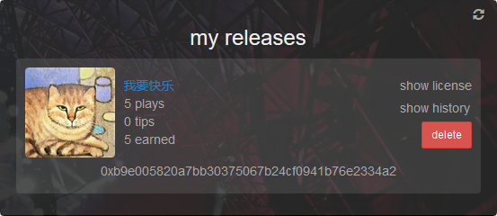

# Musicoin 相关问答

关于 Musicoin 的问题与回答。

## 1. 创建 Musicoin 的出发点？

大众需要音乐，创作需要成本，大众在获得音乐享受的同时，最好用某种恰当的方式去回报音乐创作者。而传统的音乐发行模式不能很好的保证音乐家的收入，Musicoin 为解决这个难题而创建。

> 相似国内产品有汪峰创建的“碎乐”：[www.suiyueyule.com](www.suiyueyule.com) ，但差异也很多。

## 2. 收听费用是怎么样制定的？

一首音乐，用户每收听一次，就向音乐家支付一次费用，具体费用由音乐家制定（目前默认是一个乐币）。

收听所得费用 100% 归音乐家支配。系统不会分成，也不会赚取任何其它费用。

## 3. 听众为什么愿意为音乐付费？

我们相信，大多数听众会乐意给他们喜欢的音乐家支付费用，盗版由两个因素驱动：

> 1. 方便
> 2. 听众和艺术家之间缺乏连接

通过建立一个简单，低成本的系统，提供听众和艺术家之间的直接联系，我们认为没有人有非法获得音乐的动机。

## 4. 最初的货币（乐币）是怎么来的？

与比特币一样，最初（以及所有）的货币都由矿工挖矿所得。

听众可以自己挖矿，或在交易市场购买乐币，最初，系统会帮用户支付一定的收听费用。

## 5. 如果 Musicoin 不是基于传统货币，听众如何获得这种数字货币？

Musicoin 系统中的所有货币都来自采矿。然而，我们知道大多数听众可能没有时间或兴趣去采矿，在早期，我们配置服务器挖矿，替用户支付收听费用，而音乐家则可以得到全额的收入。另外，听众也可以通过 [http://slack.musicoin.org](http://slack.musicoin.org) 的 #trading 频道交换货币。

## 5. 谁设置每首音乐的价格 - 音乐家或听众？

我们的目标是让音乐家自己控制一切。他们可以使用标准价格（也就是每收听一次一个货币），或者他们也可以根据个人意愿设置更高或更低的价格。此外，音乐家可以自定义如何分配每笔付款。

## 6. Musicoin（乐币）除了收听音乐还有什么价值？

Musicoin 会与其它数字货币对接，有些国际交易所已经在准备上线，中国地区还没有交易所开始交易。

> 国内类似的数字货币交易所：[https://bter.com/](https://bter.com/)

## 7. 用户付费后，音乐家多长时间可以收到货币？

几乎立刻。

当发布的音乐有用户收听后，在音乐家 [https://alpha.musicoin.org/nav/profile](https://alpha.musicoin.org/nav/profile) 页面的 My Releases 位置可以查看播放数量，点击 “show history”可以查看收入情况，如下图所示。

## 8 那么，我现在如何获得邀请？

我们想确保每个音乐家和听众都有一个良好的使用 Musicoin 的体验，所以我们慢慢增加用户数量。如果您是音乐家或只是对测试有兴趣，请在 [https://musicoin.org/invite?type=musician](https://musicoin.org/invite?type=musician) 申请，等待获得邀请。或者如果需要，请发送电子邮件至 musicoin@musicoin.org 联系。

或者，也可以询问你已经开始使用 Musicoin 的朋友，请他们邀请你进来。