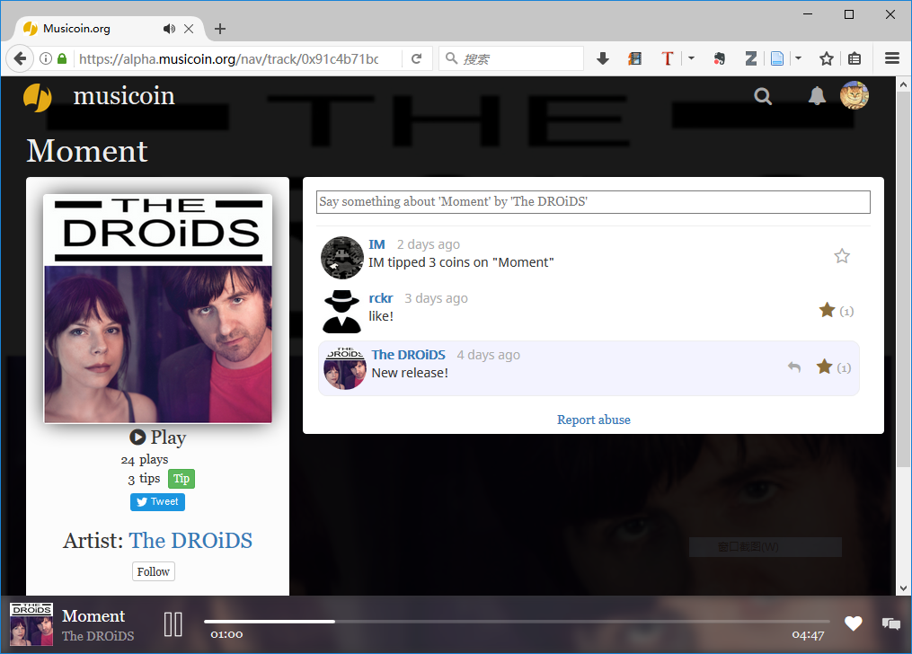
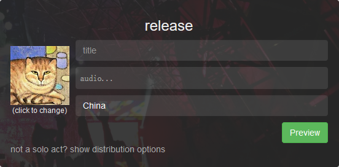
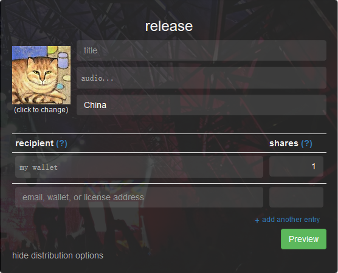

# Musicoin 使用说明

1. 注册
2. 音乐播放
3. 音乐家如何发布音乐作品？
4. 如何在 Cryptopia 市场交易 Musicoin ？
5. 如何使用 Musicoin 客户端钱包？ 

## 1. 注册

目前有两种方式获得注册资格：

1. 在网站申请，申请地址：[https://musicoin.org/invite?type=musician](https://musicoin.org/invite?type=musician) ，获得通过后，得到邀请链接申请进入。
2. 获得已经进入系统好友的邀请，并通过邀请链接申请进入。

通过以上两种方式中的任何一种，都可以得到注册资格。具有注册资格后，就可以通过 Google 、Twitter 、Facebook 三种社交网络的任何一个账户登录（要记住第一次的选择，并保证以后每次都用这个账户登录）。

如果不使用社交媒体账户登录，还可以通过电子邮件方式注册，并在以后通过邮件地址与密码的方式登录。

## 2. 音乐播放

音乐通过 Web 界面的方式播放。

### 2.1 不登录收听

虽然在目前不登录系统也可以收听音乐，但后台的机制是由系统帮你支付收听费用，这种方式下，你只需要在浏览器的地址栏输入一首音乐的链接，就会出现这首音乐的播放界面，如下图所示。

这首音乐的链接： [https://alpha.musicoin.org/nav/track/0x91c4b71bd729f0162e5144f64fe76a7e3f190d5d](https://alpha.musicoin.org/nav/track/0x91c4b71bd729f0162e5144f64fe76a7e3f190d5d)

在这个界面中，点击 Play 就会开始播放音乐。

### 2.2 登录收听

如果登录系统播放，那么可以做的更多：

- 给一首音乐打赏
- 评论一首音乐
- 给其它人的评论打赏

### 搜索

登录后，你还可以通过搜索方式查找音乐，方法是点击右上角的搜索图标，或者是直接输入搜索链接：[https://musicoin.org/nav/browse](https://musicoin.org/nav/browse)

在搜索页面，可以根据音乐家或音乐种类查找或搜索音乐，如下图所示。

## 3. 音乐家如何发布音乐作品？

发布音乐需要在登录后进入后台页面，链接：[https://musicoin.org/nav/profile](https://musicoin.org/nav/profile)。

在后台找到 Release 的位置，这里用来发布音乐，如果一首作品的音乐家只有一个人，那么填写以下内容就可以发布：

> 1. 音乐名称
> - 上传音乐文件
> - 填写一些关键词
> - 可以给音乐更换一个贴切的封面

如下图所示。

音乐作品以文件的方式上传，比如一个 MP3 格式的文件（系统支持各种格式的音乐文件）。

如果一首作品的音乐家有多个人，那么可以点击下面的 “not a solo act? show distribution options”点开分成选项。

在分成选项中，默认只有一个分成人（也就是您），点击 “+ add another entry ”会增加一行填写框，在这里可以添加更多的合作者，如下图所示。

> 1. 在前面的框，填写合作者的钱包地址。为方便记忆也可以输入合作者注册 Musicoin 的邮件地址。如果有词曲授权方，还可以输入词曲授权方的地址。
> 
> 2. 在后面的框，填写分成方式。分成用整数表示，如果有三个乐队成员，其他们等到相同的金额，那么可以可以设置为，每个人为 1 。如果分成总数为 100 的话，就与百分百的的情况相同。

填写完成后，点击“Preview”就可以查看授权协议，如下图所示。

然后点击下面绿色的 “Release” 按钮就可以发布。

## 4.  如何在 Cryptopia 市场交易 Musicoin ？

Musicoin 已经入驻 Cryptopia ，可以通过以下链接访问。

- 货币信息：[https://www.cryptopia.co.nz/CoinInfo/?coin=MUSIC](https://www.cryptopia.co.nz/CoinInfo/?coin=MUSIC)
- 交易链接：[https://www.cryptopia.co.nz/Exchange/?market=MUSIC_BTC](https://www.cryptopia.co.nz/Exchange/?market=MUSIC_BTC)

在 Musicoin 的交易页面，可以查看 Musicoin 与比特币汇率的走势，也可以直接进行 Musicoin 的买进或者卖出，如下图所示。

### 4.1 交易

在 Cryptopia 交易中，买卖双方自由报价，系统自动匹配成交（也就是有人卖出，才能有人买入）。

交易界面就在交易链接页面中部，左侧为买入，右侧为卖出，如下图所示。

人性化的一点是，即使你报了较高的价格去买入，但如果有人低价卖，那么系统会优先匹配最低的价格（可以保证你不花冤枉钱）。

### 4.2 提款与转账

点击右上角用户头像左边的 B 图标，会进入钱包页面，链接为 ： [https://www.cryptopia.co.nz/Balances](https://www.cryptopia.co.nz/Balances) ，界面如下图所示。

在这里可以进行货币的提款和转账，提款是把系统内的货币转出到外部账户，转账是系统内部，把数字货币转给其它用户。进行提款和转账操作需要点击货币左边的下箭头，如下图所示。

点击之后，会在所选货币下面出现 Withdraw（提款）与 Transfer（转账）按钮，在此操作就可以。

##  5. 如何使用 Musicoin 客户端钱包？

### 5.1 安装

Musicoin 客户端是用户与系统连接的界面，通过 Musicoin 客户端可以收听音乐（未来发布），挖矿赚取音乐币，以及基本的音乐币管理。

安装 Musicoin 客户端需要去官方 GitHub 下载安装包，地址为：[https://github.com/Musicoin/desktop/releases](https://github.com/Musicoin/desktop/releases)，下载文件见下图。

由文件名可知，提供了 Linux 、OSX 、Windows 三种系统的版本，还有开源代码。其中 Windows 分为 32 位与 64 位的版本（选用什么版本与用户的操作系统版本有关，64 位的操作系统两种版本都可以使用，32 位的操作系统只能使用 32 位的软件）。

特别方便的是，在 Windows 系统中，软件下载回来，解压缩到任何一个地方，不需要安装就可以使用。

点击文件夹中的唯一可执行文件 Musicoin-client.exe 就会启动系统。

### 5.2 使用界面

目前只显示两个界面，一个是启动界面，一个是钱包的界面。启动界面如下图所示。

在启动界面几乎不需要做什么操作，如果软件与其它节点建立稳定连接，就会自动转到音乐币操作界面，如下图所示。

钱包界面各项功能如下图所示。

其中系统总长度数字是区块链的区块总数，区块总数乘 314 就是总的货币发行量。但在以太坊（Ethereum）中，有一种特殊的 [叔块](https://jysperm.me/2016/05/blockchain-slides/)（Uncle Block）区块会独立出现，也会产生一些货币，但这类区块不是很多。

