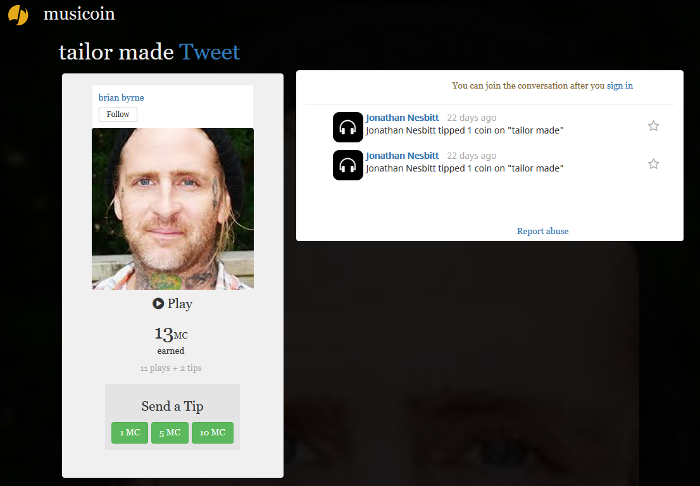

# 给 V2EX社区 的音乐爱好者及歌手或者音乐手

Musicoin 是一种新的音乐发行与消费平台。

Musicoin 以数字货币为介质重建音乐人与人类的关系。

V2EX 做为程序员与音乐爱好者居多的创意工作者们的社区，应该与 Musicoin 有更多的契合。

有多种方式可以立即接触 Musicoin ，比如点开这个 [链接](https://musicoin.org/nav/track/0xcf60eca8427105342723556f3cbd42c639b18c72)， 会打开歌手 brian byrne 演唱 tailor made 的页面，如下图：

点击头像下方的 Play 播放按钮就会在页面底部显示播放栏，并开始播放音乐。

---

在这个界面中展现出了一些 Musicoin 的特色：

## 1. 音乐家页面链接

点击头像上方的蓝色“brian byrne”可以转到 brian byrne 的主页面，能够查看以下内容。

1. brian byrne 发布的其它作品；
2. brian byrne 打赏他人的记录；
3. brian byrne 发布的消息

## 2. 播放、小费与收入统计

1. Play 按钮下面的 13MC ，表示 brian byrne 从这首歌曲得到的总收入为 13个 Musicoin（Musicoin 平台的数字货币）；
2. 在下面一行显示 “11 plays + 2 tips ”，表示这首歌曲播放了 11 次，得到 11 个 Musicoin 的收入，2 表示这首歌曲得到 2 个小费；
3. 再往下面的 “Send a Tip”是用户给这首歌曲打赏小费的按钮，可以选择 1MC  或 5MC 或 10MC；

## 3. 打赏与评论

在播放页面的右侧会显示打赏与评论。

1. 当用户对一个歌曲打赏后，用户的头像及打赏的金额会显示在右侧；
2. 用户也可以在右侧对当前歌曲发布评论，评论可以被其它用户回复；
3. 对于其它用户的评论或打赏，也可以进行加星操作，加星后也会发送一个币给评论或打赏用户。

## 4. 举报滥用行为

在右侧页面底部有一个“Report abuse”，点击这个链接可以通过电子邮件举报滥用行为。

